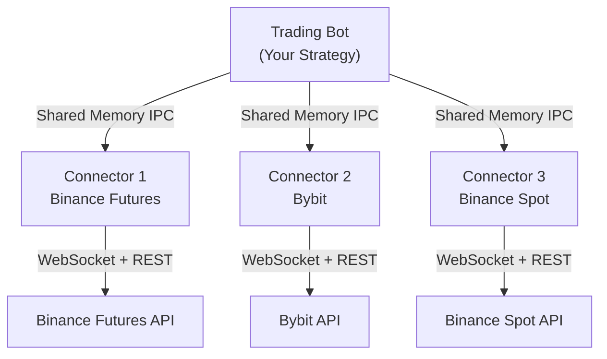

## Overview

HftBacktest supports running strategies across multiple exchanges and trading pairs simultaneously. This enables arbitrage, cross-exchange hedging, and diversified market making strategies using a single unified codebase.

## Architecture

### Connector-Based Design



**Key points:**
- Each connector runs as a separate process
- All connectors must run on the same machine as the bot
- Communication via shared memory (IPC) for minimal latency
- Each connector can manage multiple trading pairs

## Setup Multiple Connectors

### 1. Create Configuration Files

Create separate config files for each exchange:

<CodeGroup>

```toml binance_futures.toml
stream_url = "wss://fstream.binancefuture.com/ws"
api_url = "https://testnet.binancefuture.com"
order_prefix = "bf"
api_key = "BINANCE_API_KEY"
secret = "BINANCE_SECRET"
```

```toml bybit.toml
public_url = "wss://stream-testnet.bybit.com/v5/public/linear"
private_url = "wss://stream-testnet.bybit.com/v5/private"
trade_url = "wss://stream-testnet.bybit.com/v5/trade"
rest_url = "https://api-testnet.bybit.com"
category = "linear"
order_prefix = "bb"
api_key = "BYBIT_API_KEY"
secret = "BYBIT_SECRET"
```

```toml binance_spot.toml
stream_url = "wss://stream.testnet.binance.vision/ws"
ws_api_url = "wss://ws-api.testnet.binance.vision/ws-api/v3"
api_url = "https://testnet.binance.vision"
order_prefix = "bs"
api_key = "BINANCE_SPOT_API_KEY"
secret = "BINANCE_SPOT_SECRET"
```

</CodeGroup>

### 2. Start Multiple Connectors

Run each connector in a separate terminal:

```bash Terminal 1 - Binance Futures
connector --name bf --connector binancefutures --config binance_futures.toml
```

```bash Terminal 2 - Bybit
connector --name bybit --connector bybit --config bybit.toml
```

```bash Terminal 3 - Binance Spot
connector --name bs --connector binancespot --config binance_spot.toml
```

<Tip>
  Use unique `--name` values for each connector. This name is used to identify the connector in your bot code.
</Tip>

## Multi-Asset Backtesting

### Example: Two-Asset Market Making

```python
import numpy as np
from numba import njit
from hftbacktest import (
    BacktestAsset,
    HashMapMarketDepthBacktest,
    BUY,
    SELL,
    GTX,
    LIMIT
)

@njit
def multi_asset_market_making(hbt):
    """Market making on two correlated assets"""
    
    while hbt.elapse(10_000_000) == 0:  # 10ms
        # Process both assets
        for asset_no in range(2):
            hbt.clear_inactive_orders(asset_no)
            
            depth = hbt.depth(asset_no)
            tick_size = depth.tick_size
            lot_size = depth.lot_size
            
            mid_price = (depth.best_bid + depth.best_ask) / 2.0
            position = hbt.position(asset_no)
            
            # Simple market making logic
            half_spread = 0.0005 * mid_price
            skew = -0.001 * position
            
            reservation_price = mid_price + skew
            new_bid = reservation_price - half_spread
            new_ask = reservation_price + half_spread
            
            new_bid_tick = min(
                np.round(new_bid / tick_size),
                depth.best_bid_tick
            )
            new_ask_tick = max(
                np.round(new_ask / tick_size),
                depth.best_ask_tick
            )
            
            order_qty = np.round(100 / mid_price / lot_size) * lot_size
            
            # Submit orders for this asset
            hbt.submit_buy_order(
                asset_no,
                new_bid_tick,
                new_bid_tick * tick_size,
                order_qty,
                GTX,
                LIMIT,
                False
            )
            hbt.submit_sell_order(
                asset_no,
                new_ask_tick,
                new_ask_tick * tick_size,
                order_qty,
                GTX,
                LIMIT,
                False
            )
    return True

if __name__ == '__main__':
    # Asset 1: BTC on Binance Futures
    asset_btc = (
        BacktestAsset()
            .data(['data/binance/btcusdt_20220831.npz'])
            .linear_asset(1.0)
            .intp_order_latency(['latency/binance_20220831.npz'])
            .power_prob_queue_model(2.0)
            .no_partial_fill_exchange()
            .trading_value_fee_model(-0.00005, 0.0007)
            .tick_size(0.1)
            .lot_size(0.001)
    )
    
    # Asset 2: ETH on Binance Futures
    asset_eth = (
        BacktestAsset()
            .data(['data/binance/ethusdt_20220831.npz'])
            .linear_asset(1.0)
            .intp_order_latency(['latency/binance_20220831.npz'])
            .power_prob_queue_model(2.0)
            .no_partial_fill_exchange()
            .trading_value_fee_model(-0.00005, 0.0007)
            .tick_size(0.01)
            .lot_size(0.001)
    )
    
    # Create multi-asset backtest
    hbt = HashMapMarketDepthBacktest([asset_btc, asset_eth])
    multi_asset_market_making(hbt)
```

## Multi-Exchange Live Trading (Rust)

### Example: Cross-Exchange Strategy

```rust
use hftbacktest::{
    live::{
        Instrument,
        LiveBot,
        LiveBotBuilder,
        LoggingRecorder,
        ipc::iceoryx::IceoryxUnifiedChannel,
    },
    prelude::{Bot, HashMapMarketDepth},
};

fn prepare_multi_exchange() -> LiveBot<IceoryxUnifiedChannel, HashMapMarketDepth> {
    LiveBotBuilder::new()
        // Binance Futures - BTC
        .register(Instrument::new(
            "bf",              // connector name from --name
            "btcusdt",         // lowercase for Binance
            0.1,               // tick_size
            0.001,             // lot_size
            HashMapMarketDepth::new(0.1, 0.001),
            0,                 // asset_no = 0
        ))
        // Bybit - BTC
        .register(Instrument::new(
            "bybit",           // connector name
            "BTCUSDT",         // uppercase for Bybit
            0.1,
            0.001,
            HashMapMarketDepth::new(0.1, 0.001),
            1,                 // asset_no = 1
        ))
        // Binance Spot - BTC
        .register(Instrument::new(
            "bs",
            "btcusdt",         // lowercase for Binance
            0.01,
            0.00001,
            HashMapMarketDepth::new(0.01, 0.00001),
            2,                 // asset_no = 2
        ))
        .build()
        .unwrap()
}

fn cross_exchange_arbitrage<MD, I>(
    hbt: &mut LiveBot<I, MD>,
) -> Result<(), ErrorKind>
where
    MD: MarketDepth,
    I: LiveChannel,
{
    loop {
        // Check if we should exit
        if !hbt.elapse(100_000_000)? {  // 100ms
            return Ok(());
        }
        
        // Get depths from all exchanges
        let depth_binance = hbt.depth(0);  // Binance Futures
        let depth_bybit = hbt.depth(1);     // Bybit
        let depth_spot = hbt.depth(2);      // Binance Spot
        
        // Check for arbitrage opportunities
        let binance_mid = (depth_binance.best_bid + depth_binance.best_ask) / 2.0;
        let bybit_mid = (depth_bybit.best_bid + depth_bybit.best_ask) / 2.0;
        let spot_mid = (depth_spot.best_bid + depth_spot.best_ask) / 2.0;
        
        // Example: Futures-Spot arbitrage
        let basis = binance_mid - spot_mid;
        let threshold = 10.0;  // $10 basis
        
        if basis > threshold {
            // Sell futures, buy spot
            println!("Arbitrage opportunity: basis = {}", basis);
            // Implement your arbitrage logic here
        } else if basis < -threshold {
            // Buy futures, sell spot
            println!("Arbitrage opportunity: basis = {}", basis);
        }
    }
}

fn main() {
    tracing_subscriber::fmt::init();
    
    let mut hbt = prepare_multi_exchange();
    hbt.run().unwrap();
    
    cross_exchange_arbitrage(&mut hbt).unwrap();
    
    hbt.close().unwrap();
}
```

## Strategy Patterns

### 1. Statistical Arbitrage

```python
@njit
def stat_arb(hbt):
    """Trade based on price divergence between correlated assets"""
    while hbt.elapse(100_000_000) == 0:  # 100ms
        # Get mid prices
        mid_0 = (hbt.depth(0).best_bid + hbt.depth(0).best_ask) / 2.0
        mid_1 = (hbt.depth(1).best_bid + hbt.depth(1).best_ask) / 2.0
        
        # Calculate z-score of price ratio
        ratio = mid_0 / mid_1
        # In practice, use rolling mean and std
        mean_ratio = 100.0
        std_ratio = 2.0
        z_score = (ratio - mean_ratio) / std_ratio
        
        # Trade on divergence
        if z_score > 2.0:
            # Ratio too high: sell asset 0, buy asset 1
            print(f"Signal: Sell asset 0, Buy asset 1 (z={z_score})")
        elif z_score < -2.0:
            # Ratio too low: buy asset 0, sell asset 1
            print(f"Signal: Buy asset 0, Sell asset 1 (z={z_score})")
    return True
```

### 2. Cross-Exchange Market Making

```python
@njit
def cross_exchange_mm(hbt):
    """Make markets on one exchange hedged by another"""
    primary = 0    # Make markets here
    hedge = 1      # Hedge on this exchange
    
    while hbt.elapse(10_000_000) == 0:
        hbt.clear_inactive_orders(primary)
        
        # Use hedge exchange mid as reference price
        hedge_depth = hbt.depth(hedge)
        ref_price = (hedge_depth.best_bid + hedge_depth.best_ask) / 2.0
        
        # Make markets on primary exchange around reference
        primary_depth = hbt.depth(primary)
        spread = 0.001 * ref_price  # 10 bps
        
        bid = ref_price - spread
        ask = ref_price + spread
        
        # Submit orders...
        # (order submission code)
    return True
```

### 3. Triangular Arbitrage

```python
@njit 
def triangular_arb(hbt):
    """Arbitrage across three related pairs"""
    # Example: BTC/USDT, ETH/USDT, ETH/BTC
    btc_usdt = 0
    eth_usdt = 1  
    eth_btc = 2
    
    while hbt.elapse(100_000_000) == 0:
        # Get mid prices
        btc_price = (hbt.depth(btc_usdt).best_bid + 
                     hbt.depth(btc_usdt).best_ask) / 2.0
        eth_price = (hbt.depth(eth_usdt).best_bid + 
                     hbt.depth(eth_usdt).best_ask) / 2.0
        eth_btc_price = (hbt.depth(eth_btc).best_bid + 
                         hbt.depth(eth_btc).best_ask) / 2.0
        
        # Calculate implied ETH/BTC from USD pairs
        implied_eth_btc = eth_price / btc_price
        
        # Check for arbitrage
        diff = eth_btc_price - implied_eth_btc
        threshold = 0.0001  # 1 bps
        
        if abs(diff) > threshold:
            print(f"Triangular arb opportunity: {diff}")
            # Execute arbitrage trade
    return True
```

## Important Considerations

<AccordionGroup>
  <Accordion title="Latency Differences" icon="clock">
    Different exchanges have different latencies:
    - Binance Market Maker endpoints: ~5-10ms
    - Standard endpoints: ~20-50ms
    - Cross-exchange strategies need to account for latency skew
    
    Use `latency_offset` parameter when backtesting:
    ```python
    asset.intp_order_latency(
        ['latency/exchange1.npz'],
        latency_offset=5_000_000  # 5ms offset
    )
    ```
  </Accordion>
  
  <Accordion title="Symbol Name Differences" icon="text">
    Each exchange uses different symbol conventions:
    - **Binance**: lowercase (`btcusdt`)
    - **Bybit**: uppercase (`BTCUSDT`)
    - **Binance 1000x symbols**: `1000shibusdt`
    
    Always check the exchange documentation.
  </Accordion>
  
  <Accordion title="Fee Structures" icon="dollar-sign">
    Account for different fee structures:
    ```python
    # Binance MM program
    .trading_value_fee_model(-0.00005, 0.0007)
    
    # Standard tier
    .trading_value_fee_model(0.0002, 0.0005)
    ```
    
    Fee differences can make or break arbitrage strategies.
  </Accordion>
  
  <Accordion title="Position Limits" icon="shield">
    Each exchange has different:
    - Maximum position sizes
    - Leverage limits  
    - Order size restrictions
    - Rate limits
    
    Implement proper risk management for each exchange.
  </Accordion>
  
  <Accordion title="Time Synchronization" icon="clock">
    For multi-exchange strategies:
    - Ensure system clock is synchronized (use NTP)
    - Account for timestamp differences between exchanges
    - Some exchanges use different timestamp precision
  </Accordion>
</AccordionGroup>

## Best Practices

<CardGroup cols={2}>
  <Card title="Independent Connectors" icon="plug">
    Each connector is independent:
    - Can restart without affecting others
    - Isolated error handling
    - Separate rate limiting
  </Card>
  
  <Card title="Shared Memory Efficiency" icon="gauge-high">
    IPC communication is fast but:
    - All components on same machine
    - Minimal serialization overhead
    - Direct memory access
  </Card>
  
  <Card title="Atomic Operations" icon="atom">
    When trading across exchanges:
    - Use timeouts for order confirmation
    - Implement rollback logic
    - Handle partial fills carefully
  </Card>
  
  <Card title="Monitor All Connections" icon="signal">
    Watch for connection issues:
    - Implement error handlers for each exchange
    - Log connection states
    - Have reconnection logic
  </Card>
</CardGroup>

## Example: Multi-Asset Grid Trading

Here's a complete example trading multiple pairs across exchanges:

```python
from hftbacktest import BacktestAsset, HashMapMarketDepthBacktest

# Load data for multiple exchanges
assets = []

# Binance Futures assets
for symbol in ['btcusdt', 'ethusdt']:
    asset = (
        BacktestAsset()
            .data([f'data/binance/{symbol}_20240808.npz'])
            .linear_asset(1.0)
            .intp_order_latency(['latency/binance_20240808.npz'])
            .power_prob_queue_model(2.0)
            .no_partial_fill_exchange()
            .trading_value_fee_model(-0.00005, 0.0007)
            .tick_size(0.1 if symbol == 'btcusdt' else 0.01)
            .lot_size(0.001)
    )
    assets.append(asset)

# Bybit assets
for symbol in ['BTCUSDT', 'ETHUSDT']:
    asset = (
        BacktestAsset()
            .data([f'data/bybit/{symbol}_20240808.npz'])
            .linear_asset(1.0)
            .intp_order_latency(
                ['latency/bybit_20240808.npz'],
                latency_offset=2_000_000  # 2ms higher latency
            )
            .power_prob_queue_model(2.0)
            .no_partial_fill_exchange()
            .trading_value_fee_model(-0.00005, 0.0007)
            .tick_size(0.1 if 'BTC' in symbol else 0.01)
            .lot_size(0.001)
    )
    assets.append(asset)

# Run backtest on all assets
hbt = HashMapMarketDepthBacktest(assets)
multi_exchange_strategy(hbt)
```

## Resources

- [Connector Architecture](https://github.com/nkaz001/hftbacktest/blob/master/connector/README.md)
- [Multi-Asset Backtesting Example](https://github.com/nkaz001/hftbacktest/blob/master/examples/Making%20Multiple%20Markets.ipynb)
- [Live Bot Implementation](https://github.com/nkaz001/hftbacktest/blob/master/hftbacktest/examples/gridtrading_live.rs)
